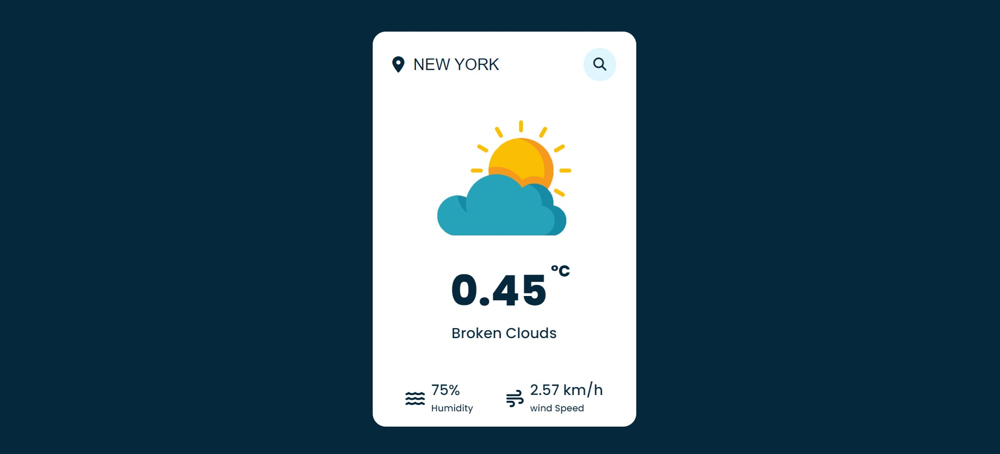

<a href=""><strong>➥ Live Demo</strong></a>

### Weather App
In this project i use a weather api and we get data from <a href="https://openweathermap.org/">openweathermap.org/</a> api❗️

## Warning
You need to get your own api key (in video we showed how!) and replace it in app.js file on line 8 :

```javascript
const APIKey = 'Your Api Key';
```


# Screenshot
Here is project screenshot :


